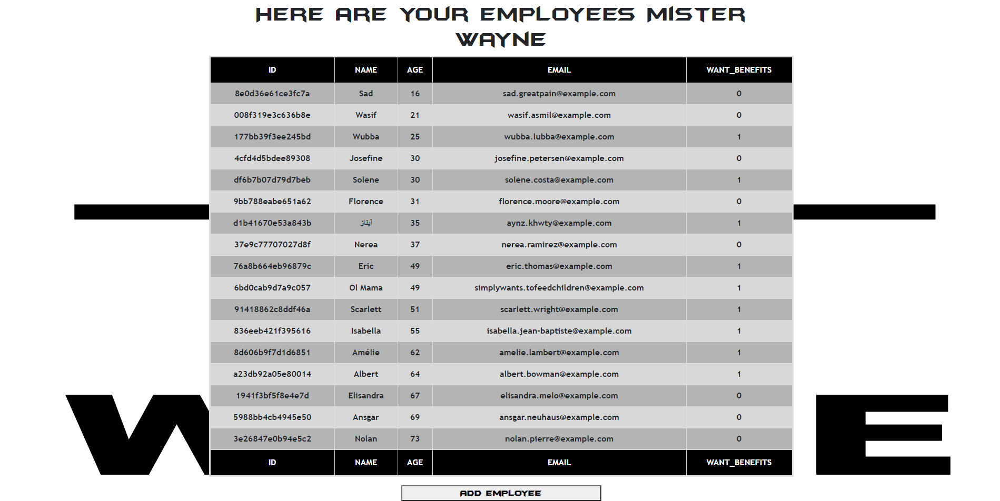
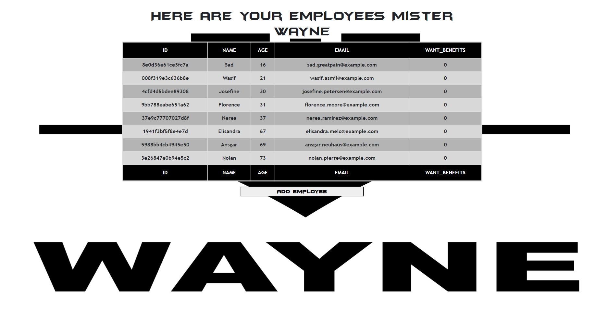

# Employee Directory Using React

## Overview

You are Bruce Wayne waking up from a long night of crime fighting. Alfred has awoken you to let you know that you're needed to check out the employee directory and filter your employees for information. You, being the genius that you are, have already created an application that can sort through your employees and fire... I mean filter the freeloarders and add more employees to keep your company up and running.

## User Story

* As a user, I want to be able to view my entire employee directory at once so that I have quick access to their information.

## Business Context

An employee or manager would benefit greatly from being able to view non-sensitive data about other employees. It would be particularly helpful to be able to filter employees by whether or not they're looking for benefits.

## Images

